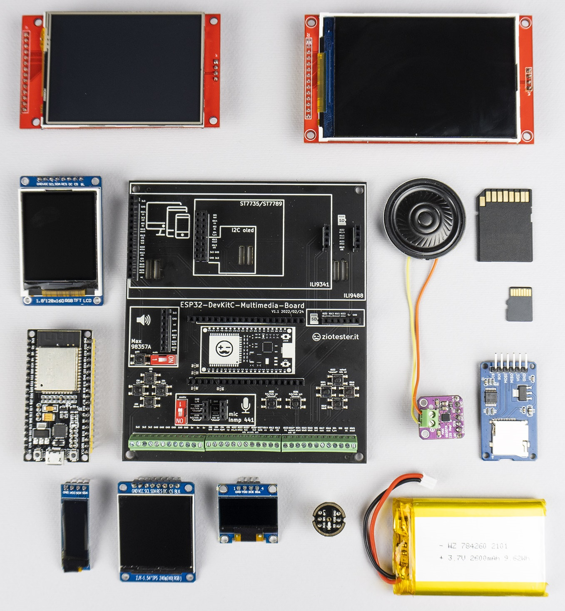

### I2C SSD1306 Oled display and ESP32

Example projects for **ESP32-DevKitC-Multimedia-Board**  and **SSD1306 Oled display** by **ZioTester Lab**.

Info, guides, tutorials and documentation: [HERE](http://ziotester.github.io/hardware/mmb)

